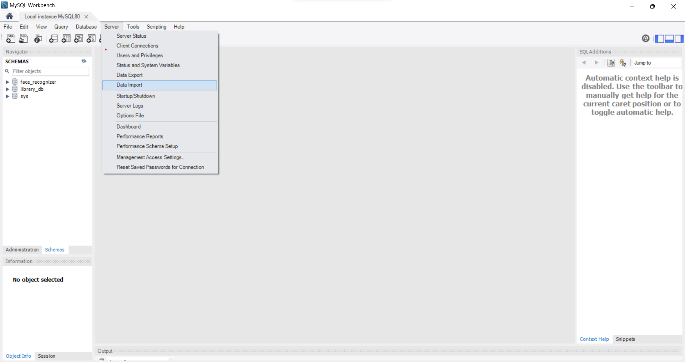
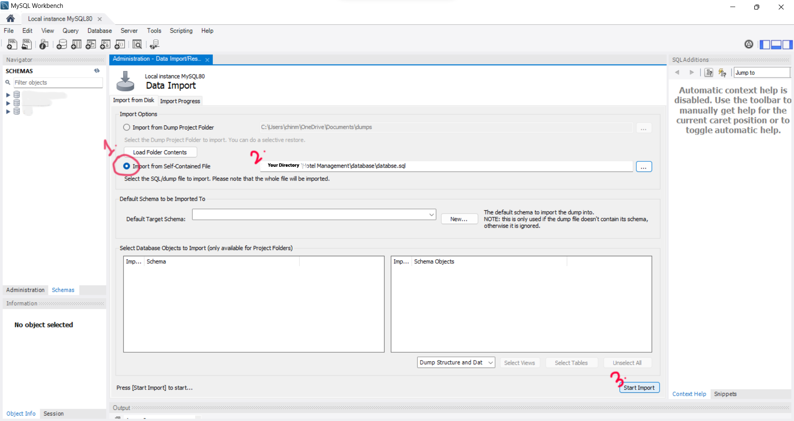
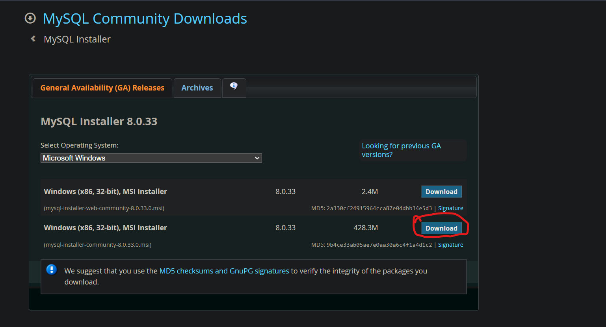

**1**  **Install** the file **Face Recognition Attendance-1.1.0-win64.md** .

**2** Then Install MYSQL with the followng instructions: 

1. If you have mysql then uninstall it **or** change its password to **root** 

    Then import the **student.sql** from the **database** folder

    

    

2. If you dont have MYSQL then install MySQL through the following instructions

    1. Download installer from - https://dev.mysql.com/downloads/installer/

        

    2. Open the Installer *(.msi file)*

    3. Click on Custom 

    4. Select the products:
        
        1. Mysql Shell
        2. Mysql Router
        3. Mysql Workbench
        4. Mysql Server
        5. Mysql connector for python  

            1. If you dont have python install it from  https://www.python.org/downloads/release/python-3109/

                Select Window Installler 64 bit  the last option at the down of the page
            
    5. Click **next** and after that **execute**

        **Note:** If you dont have C++ Build tools it will ask you to install that click ok to install

    6. Dont change anything in **Type and Networking**

    7. Use RECOMMENDED option in Authentication method

    8.  *** ***MOST IMPORTANT STEP*** *** 
        1. Set the password to ***root*** in Account and Roles

    9. After that only click Next and Exexute 

    10. Then after finishing the installation it will open **Mysql Workbench** and **Shell** (*close the shell*)

    11. Enter the password root after clicking on **Local instace Mysql 80**

    12. Select schemas from Navigator panel

    13. Start the import From the steps mentioned above 

    14. reload the window

    15. Your setup is complete now u can use the Face Recognition Attendance from **Face Recognition Attendance.exe** file in the directory .

**3** Email to  ***chinmay8521@gmail.com*** for any further details or problems or if you want the raw code

